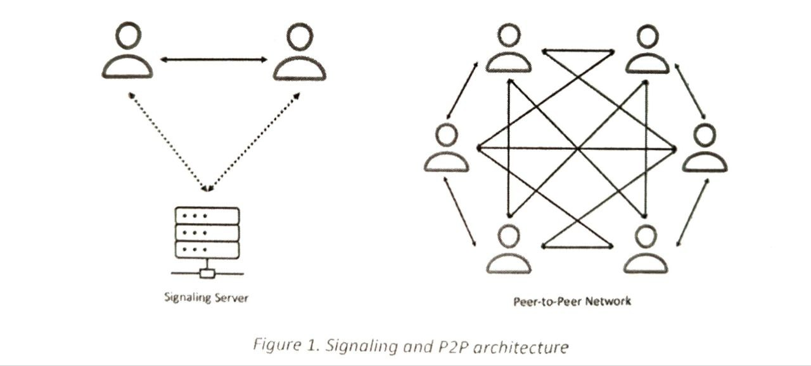
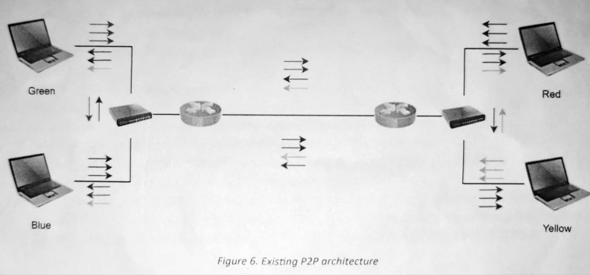
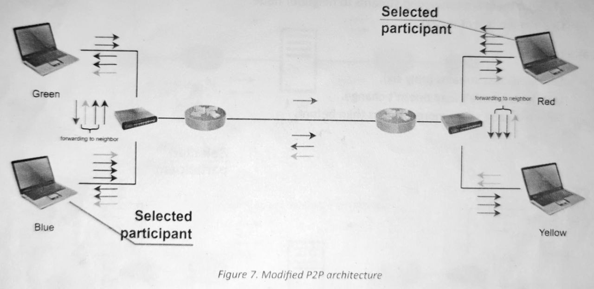

# webrtc-sandbox

## Optimizing P2P video-conferencing in WebRTC.

This repository contains the implementaion of a PoC (Proof of Concept) that demonstrates the advantages and disadvantages of using a relay node within LANs to be responsible of all Inter-LAN communication for WebRTC's P2P architecture.

## Peer-to-peer (P2P) architecture
In P2P architecture everyone is connected to everyone, meaning each participant send their video stream (and their audio stream) to everyone and in return gets a video stream from everyone. The initialization of a connection between each pair of peers is called the signaling process. Only during this initialization phase is a central server is involved, the signaling server forwards this information to all other perrs. The peers use this information to set up a direct connection to each other which is then used to transfer the video stream. making it clear why P2P does not scale with the number of paticipants in a conference.

## Example scenario: multiple participants in the same LAN/Corporate network
We can often see cases when mulitple participants in videoconference reside in the same site/corporate network/LAN. In result, the same video packets are delivered to the same site/LAN multiple times. For such a scenario we want to decrease the amount of traffic exachanged between different networks by some mechanism. 

### Proposed algorithm works as follows:
- In the above scenario, we carefully select one participant in one site which has a special responsibility compared to the other participants in the same site.
- Downstream video is sent only to the selected participant. 
- Selected participant then immediately forwards these streams to neighbor participants in the same site/LAN. Forwarding delay is supposed to be very small since they reside in the same site/LAN.
- All upstream videos are sent as usual except for some cases.

Let's see the following example. Suppose we have two sites that are taking part in the videoconference. In each site, there are two participants.

- Each node sends and receives thress streams.
- Two sites exchange eight streams in total.

After we apply the proposed algorithm,
- The unselected nodes send less streams (only two).
- Selected nodes however send (more) four streams: one to the other site and other streams to neighbor node.
- Two sites exchange only four streams in total.

## Design

## Implementation 

### Tech stack

## Testing

## Results

## Conclusion 

<!-- # Checklist
[x] Check the feasibility of the idea. The idea may require modification of browser source code. Adjust the algorithm if needed. 
[] Evaluate the proposed algorithm using NS-3.
[] Implement the algorithm in a real environment and evaluate its performance.
-->
